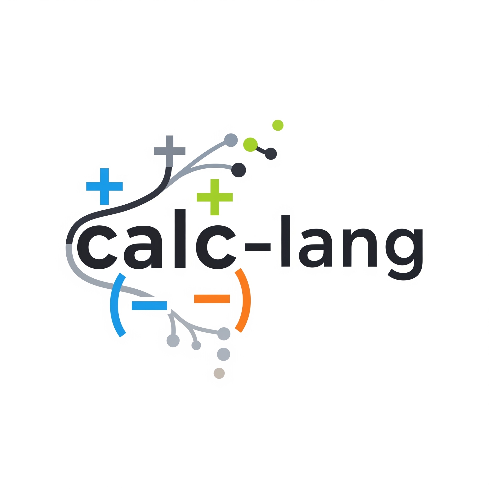

<p align="center">
  
</p>

# calc

A toy programming language with a simple grammar, built in Rust.

> **Status:** Draft — this project is in early development. Currently it contains the grammar documentation and sample parsers.

## Language

calc supports variable declaration (`@`), reading input (`>`), assignment (`:=`), basic arithmetic expressions (`+`, `-`, `*`, `/`), and printing output (`<`).

### Grammar

See [`docs/grammar.bnf`](docs/grammar.bnf) for the full BNF grammar.

| Syntax | Meaning |
|---|---|
| `@ x` | Declare variable |
| `> x` | Read input into variable |
| `x := <expr>` | Assign expression to variable |
| `< <expr>` | Print expression |

### Example Program

```
@ x
@ y
@ sum
@ diff
@ product
> x
> y
sum := x + y
diff := x - y
product := x * y
< sum
< diff
< product * (sum + 2)
```

## Project Structure

- **`docs/`** — Grammar specification (BNF)
- **`calc_parser/`** — Parser for the calc language (WIP)
- **`sample_nom_parsers/`** — Sample parsers using [nom](https://crates.io/crates/nom)

## References

This project is based on [*Creative Projects for Rust Programmers*](https://www.packtpub.com/product/creative-projects-for-rust-programmers/9781789346220) by Carlo Milanesi (Packt). The book's source code is available at [PacktPublishing/Creative-Projects-for-Rust-Programmers](https://github.com/PacktPublishing/Creative-Projects-for-Rust-Programmers).
